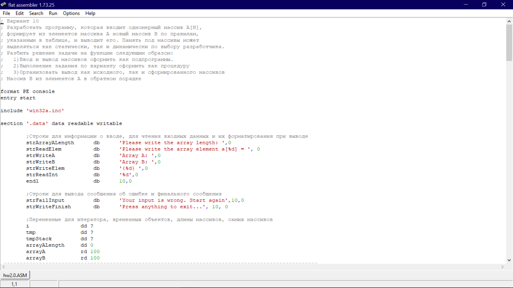
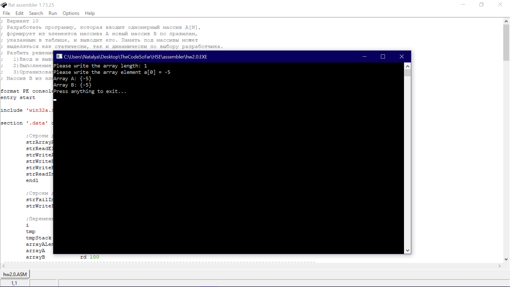
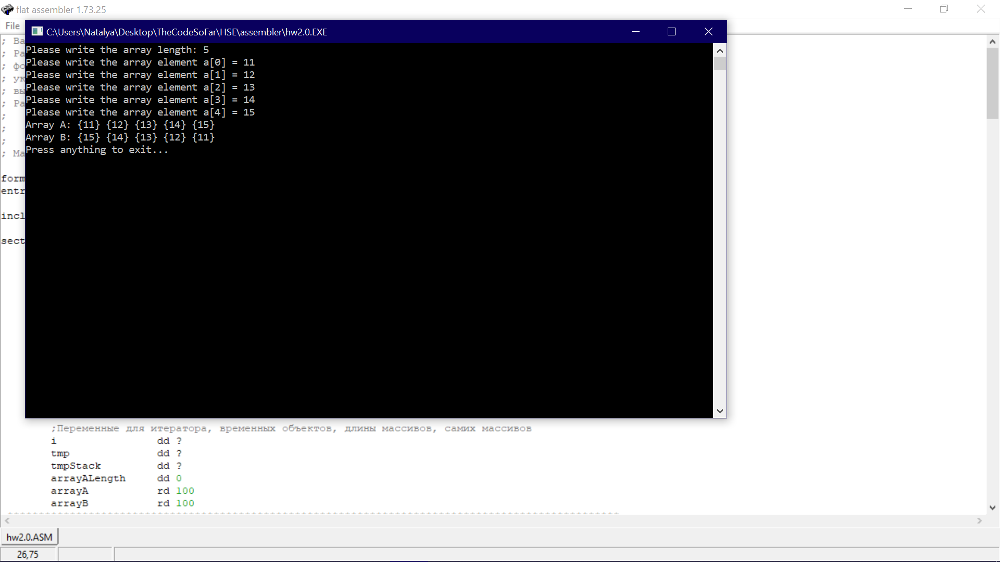
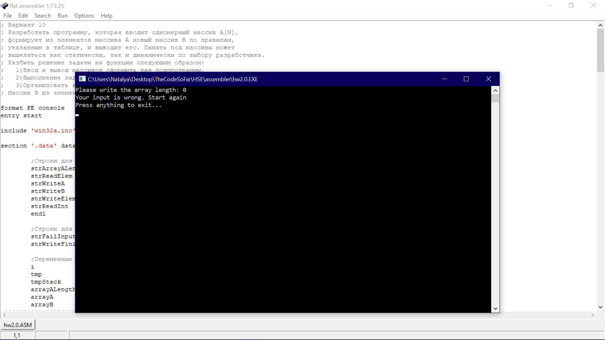

Задание вариант 10 на считывание массива, создание нового на основе элементов первого в обратном порядке и вывод того и другого массивов.
На фото:

код в среде,

два примера работы программы на корректных данных- массив действительно считывается, создается новый перевернутый и оба выводятся,

примеры работы программы (точнее корректного завершения ее работы) на некорректных входных данных

неположительные и нечисловой размеры массива, 

нечисловые значения элементов массива - тогда выводится сообщение об ошибке и программа завершается.
